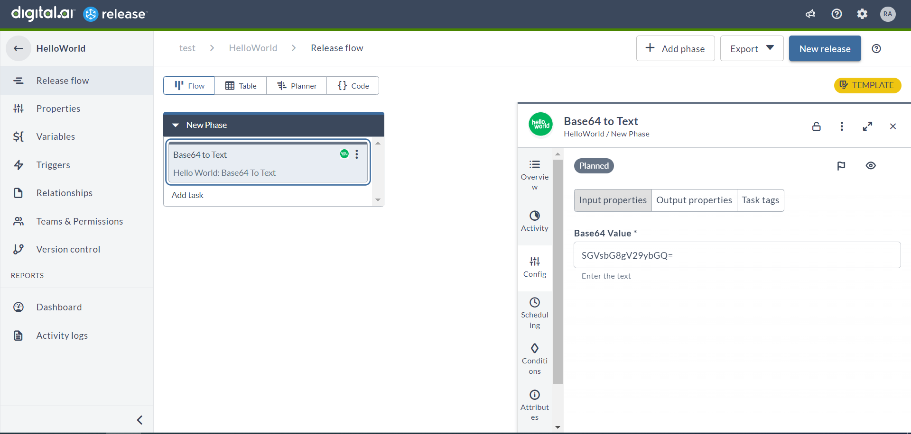
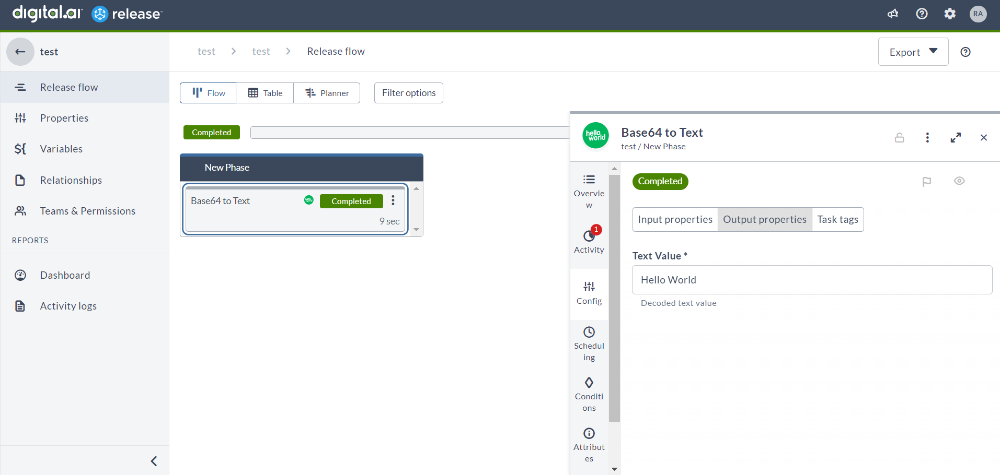
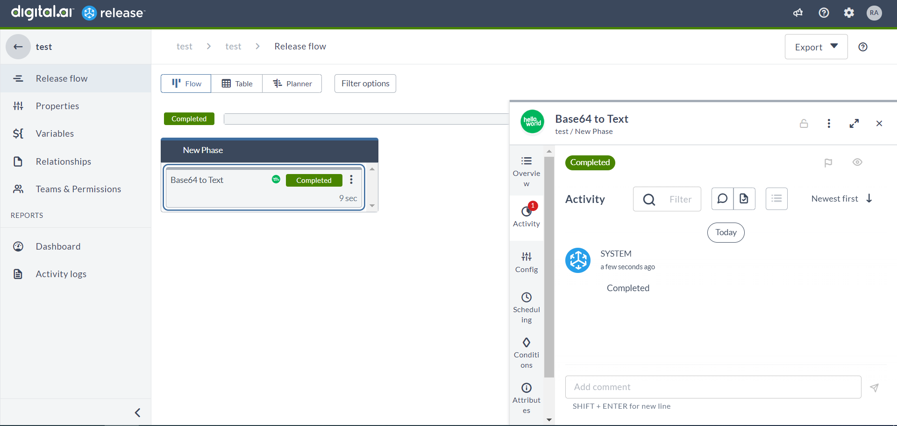

# SDK tutorial outline

## Welcome 

_The tutorial has a welcome section outlining the basic architecture_

_Topics covered:_
* _Tasks are run as containers. This allows you to write Release tasks using any language. We have support for Python3 and Go (soon) in the SDK_
* _SDK provides the tools to create container-based tasks_
* _Architecture: Release instance + Remote Runner_
* _Tasks are developed as container + traditional plugin jar containing metadata_


## Prerequisites

In order to use the Digital.ai Release Integration SDK for Python, you will need:

* Python 3 installed
* Git
* Docker
* A Kubernetes environment, for example Docker Desktop
* Digital.ai Release running
* Digital.ai `xl` command line utility (including `kubectl` and `helm`)


## XXX TODO XXX

* Install prerequisites in separate document
* List convenience methods -- link to API?
* Anatomy of a project
* Merge template repo and hello world. (See instructions on how to create a copy in README). Maybe add a 'clean.sh' script that will give you an empty skeleton. It is just too confusing to have two projects.
* `from digitalai.release.container import BaseTask` =>
  `from digitalai.release.integration import BaseTask`
* Is there a build step to builds both jar and image?
* Should I set up a virtual environment in Python
* What is the registry
  * Use `docker run -d -p 5050:5000 --name xlr-registry registry:2`
* Uninstall:
  * `helm delete remote-runner -n digitalai`


## Hello World Plugin

### Code & Test

### _Tutorial walks you through setting up a Python 3 project_

* **Install Python 3:** If you haven't already done so, you'll need to install Python 3 on your computer. You can download the latest version of Python from the official website at https://www.python.org/downloads/. Make sure to select the appropriate installer for your operating system.
* **Choose an IDE or Text Editor:** You can write Python code using any text editor, but using an IDE (Integrated Development Environment) will help you manage your project better. Some popular IDEs for Python include PyCharm, Visual Studio Code, and Spyder.
* **Create a new project:** Open your IDE and create a new project. This will typically involve creating a new folder where your project files will be stored.

### _Explains how to create a git project from template_

* **Install Git:** If you haven't already done so, you'll need to install Git on your computer. You can download the latest version of Git from the official website at https://git-scm.com/downloads. Make sure to select the appropriate installer for your operating system.
* **Open a Terminal or Command Prompt:** Open a terminal or command prompt on your computer.
* Navigate to the directory where you want to store the project: Navigate to the directory where you want to store the project on your computer using the command prompt or terminal.
* **Clone the repository:** Clone the repository by running the following command in your terminal:
* ``` 
    git clone https://github.com/xebialabs/xlr-container-helloworld-integration.git 
    ```
  Or download from https://github.com/xebialabs/xlr-container-helloworld-integration
* This will create a new directory with the name "xlr-container-helloworld-integration" in your current working directory, and clone the project files from the GitHub repository into that directory.
* **Install Dependencies:** Navigate to the project directory and install the dependencies required for the project using the following command:
* ``` 
    cd xlr-container-helloworld-integration
    pip install -r requirements.txt 
  ```
* This command will change your directory to the cloned repository and install the required Python packages listed in the requirements.txt file.


### _(Optional) Explains how to set up IDE_

* **Install PyCharm:** If you haven't already done so, you'll need to download and install PyCharm on your computer. You can download the latest version of PyCharm from the official website at https://www.jetbrains.com/pycharm/download/. Make sure to select the appropriate installer for your operating system.
* **Open the project in PyCharm:** Open PyCharm and select "Open" from the welcome screen. Navigate to the directory where you cloned the project and select it. Click "Open" to open the project in PyCharm.
* **Configure the project interpreter:** PyCharm needs to know which version of Python to use for your project. To configure the project interpreter, go to File > Settings > Project: xlr-container-helloworld-integration > Python Interpreter. Click on the gear icon and select "Add". From the dropdown menu, select "New Environment" and choose the appropriate version of Python. Click "OK" to create the new interpreter.

### _Explains Python SDK_

The Digital.ai Python SDK is a set of tools that developers can use to create container-based tasks.

The BaseTask abstract class in the SDK is a blueprint for defining tasks. It contains several methods and attributes that can be utilized by subclasses of the BaseTask class. To create a custom task, developers need to create a new class that extends the BaseTask abstract class and implement the task logic in the subclass.

The SDK will execute the task by calling the execute() method in the subclass. The execute() method contains the task logic, and it can be customized to perform any necessary operations. In the below example, The Base64Decode class is an example of a subclass that extends the BaseTask abstract class. It handles the properties for the input and output values for the task and implements the execute() method to decode a Base64 string and output the result.

The execute_task() method in the BaseTask abstract class is responsible for executing the task. It calls the execute() method and handles any exceptions that may occur during task execution. The set_exit_code() and set_error_message() methods are used to set the exit code and error message for the task, respectively.

The SDK also provides several other methods and attributes that can be used to interact with the task execution environment. For example, the add_comment() method can be used to add a comment to the task output, and the set_status_line() method can be used to set the status line for the task. The get_output_properties() method returns a dictionary containing the output properties for the task.

The abort() method is used to signal to the SDK that the task execution should be aborted. When abort() is called, it sets the exit code to 1 and immediately exits the task process, causing the task to be marked as failed.

Overall, the SDK provides a powerful set of tools for creating container-based tasks. Developers can use the BaseTask abstract class as a starting point to define their custom tasks and take advantage of the other methods and attributes provided by the SDK to interact with the task execution environment.


* **BaseTask** abstract class contains the following methods and attributes:
  * **__init__(self):** Initializes an instance of the BaseTask class. It creates an OutputContext object with an initial exit code of 0 and an empty dictionary of output properties.
  * **execute_task(self) -> None**: Executes the task by calling the execute() method. If an AbortException is raised during execution, the task's exit code is set to 1, and the program exits with a status code of 1. If any other exception is raised, the task's exit code is also set to 1.
  * **execute(self) -> None**: This is an abstract method that must be implemented by subclasses of BaseTask. It represents the main logic of the task.
  * **abort(self) -> None**: Sets the task's exit code to 1 and exits the program with a status code of 1.
  * **get_output_context(self) -> OutputContext**: Returns the OutputContext object associated with the task.
  * **get_output_properties(self) -> Dict[str, Any]**: Returns the output properties dictionary of the task's OutputContext object.
  * **set_exit_code(self, value) -> None**: Sets the exit code of the task's OutputContext object.
  * **set_error_message(self, value) -> None**: Sets the error message of the task's OutputContext object.
  * **add_comment(self, comment: str) -> None**: Logs a comment of the task.
  * **set_status_line(self, status_line: str) -> None**: Set the status of the task.
  * **add_reporting_record(self, reporting_record: Any) -> None**: Adds a reporting record to the OutputContext.

### _Explains project files for xlr-container-helloworld-integration_

* **Template project location :** https://github.com/xebialabs/release-integration-template-python
* **resources/test.png :** This file is the plugin icon for the project.
* **resources/plugin-version.properties :** This file contains the plugin name and version. The placeholder values will be replaced by the build script.
* **resources/synthetic.xml :** This file contains the task released inputs and output details. It defines the input and output fields for the task, as well as any additional properties or configurations that may be necessary.
* **src/base64_decode.py :** This file contains the logic for the **Base64 Decode** task.
* **src/dummy_json.py :** This file contains the logic for the **Dummy Json** task.
* **src/hello.py :** This file contains the logic for the **Hello** task.
* **tests/test_base64_decode.py :** This file contains the test case for the **Base64 Decode** task.
* **tests/test_dummy_json.py :** This file contains the test case for the **Dummy Json** task.
* **tests/test_hello.py :** This file contains the test case for the **Hello** task.
* **build.bat and build.sh :** These files build the plugin jar and publish the image to a registry. 
* **Dockerfile :** This file is used to create an image for the plugin logic. It includes the necessary steps to build and package the plugin logic in a containerized format.
* **project.properties :** This file is used to configure the plugin name, version, and registry details. It includes properties such as PLUGIN, VERSION, REGISTRY_URL, and REGISTRY_ORG, which are used by the build scripts.
* **README.md :** This file is the readme for the project. It includes information about the project, its purpose, and how to use it. It also includes any relevant installation, configuration, and usage instructions.
* **requirements.txt :** It includes a list of Python packages and their respective versions that are required to run the project. These packages can be installed using the pip package manager.

### _Explains coding for xlr-container-helloworld-integration_

#### _Explains synthetic.xml :_

```xml
  <synthetic xmlns:xsi="http://www.w3.org/2001/XMLSchema-instance"
             xmlns="http://www.xebialabs.com/deployit/synthetic"
             xsi:schemaLocation="http://www.xebialabs.com/deployit/synthetic synthetic.xsd">
  
      <type type="example.BaseTask" extends="xlrelease.ContainerTask" virtual="true">
          <!-- Container image - location of the task logic -->
          <property name="image" required="true" hidden="true" default="@registry.url@/@registry.org@/@project.name@:@project.version@" transient="true"/>
          <!-- Task UI properties -->
          <property name="iconLocation" default="test.png" hidden="true"/>
          <property name="taskColor" hidden="true" default="#667385"/>
      </type>
  
      <type type="example.Hello" extends="example.BaseTask" description="Simple greeter task">
          <property name="yourName" category="input" kind="string" default="World"/>
          <property name="greeting" kind="string" category="output"/>
      </type>
  
      <type type="example.Base64Decode" extends="example.BaseTask" description="Decode Base64 to text">
          <property name="base64Value" category="input"  default="SGVsbG8gV29ybGQ=" description="Enter the text"/>
          <property name="textValue" category="output" description="Decoded text value"/>
      </type>
  
      <type type="example.Server" extends="configuration.HttpConnection" description="Configure the server.">
          <!-- Hide the fields which are not relevant for the integration -->
          <property name="domain" default="empty" hidden="true"/>
          <property name="clientId" default="empty" hidden="true"/>
          <property name="clientSecret" default="empty" hidden="true" password="true"/>
          <property name="scope" default="empty" hidden="true"/>
          <property name="accessTokenUrl" default="empty" hidden="true"/>
          <property name="authenticationMethod" kind="enum"
                    enum-class="com.xebialabs.xlrelease.domain.configuration.HttpConnection$AuthenticationMethod"
                    default="Basic" hidden="true">
              <enum-values>
                  <value>Basic</value>
              </enum-values>
          </property>
      </type>
  
      <type type="example.DummyJson" extends="example.BaseTask" description="Simple API task">
          <property name="server" category="input" referenced-type="example.Server" kind="ci"/>
          <property name="productId" category="input" kind="string" default="1"/>
          <property name="productName" kind="string" category="output"/>
          <property name="productBrand" kind="string" category="output"/>
      </type>
  
  </synthetic>
 ```

The synthetic.xml file that describes the task released server, inputs and output details.
  * **<type>** Defines a custom task type with a unique name, a parent type to extend, and any additional properties or configurations that the task requires. 
  * **example.BaseTask** type defines a container image, icon location and task color properties for task.
  * **example.Hello** type defines properties for input and output values for Hello task.
    * **example** is a unique name for integration.
    * **Hello** is a user-defined python class name. The SDK will find the Hello class in src folder and create the instance at runtime.
  * **example.Base64Decode** type defines properties for input and output values for Base64Decode task.
  * **example.Server** type defines properties for DummyJson server
  * **example.DummyJson** type defines properties for input and output values for DummyJson task.

#### _Explains Base64Decode.py :_

```python
  import logging
  import requests
  from digitalai.release.container import BaseTask
  
  logger = logging.getLogger('Digitalai')
  
  class Base64Decode(BaseTask):
  
      def __init__(self, params):
          super().__init__()
          self.params = params
          self.textValue = None
  
      def execute(self) -> None:
          try:
              base64_value = self.params['base64Value']
              response = requests.get(f'https://httpbin.org/base64/{base64_value}')
              response.raise_for_status()
              if 'Incorrect Base64 data' in response.text:
                  raise ValueError(response.text)
              self.textValue = response.text
          except Exception as e:
              logger.error("Unexpected error occurred.", exc_info=True)
              self.set_exit_code(1)
              self.set_error_message(str(e))
          finally:
              output_properties = self.get_output_properties()
              output_properties["textValue"] = self.textValue
 ```

  * The **Base64Decode** class is a subclass of BaseTask abstract class, which represents a task that can be executed.   
  * This task is specifically designed to convert a given Base64 encoded value to plain text.
  * The **Base64Decode** class has the following attributes:
    * **params**: A dictionary containing the parameters required for executing the task. Params value will be passed by the SDK at runtime.
    * **textValue**: A variable that stores the resulting plain text value obtained after decoding the Base64 encoded value.  
  * The **Base64ToTex**t class has the following methods:
    * **__init__(self, params)**: Initializes an instance of the Base64ToText class. 
      * **super().__init__()**: It calls the __init__() method of its superclass BaseTask. It must be present.
      * sets the params and textValue attributes to their default values.
    * **execute(self)**: This method is an implementation of the abstract method **execute()** defined in the BaseTask class. It represents the main logic of the task. This method does the following:
      * It retrieves the base64Value parameter from the params dictionary.
      * It makes a GET request to https://httpbin.org/base64/{base64_value} endpoint with base64_value as the value of the Base64 encoded string.
      * It checks whether the response returned contains the message "Incorrect Base64 data". If yes, it raises a ValueError with the response text.
      * If the response is successful, it sets the textValue attribute with the plain text obtained by decoding the Base64 encoded string.
      * If any exception occurs during execution, an error message is logged using the **logger** object and the exit code of the task is set to 1 using the **set_exit_code()** method from **BaseTask**. Additionally, the error message is set using the **set_error_message()** method from **BaseTask**.
      * Finally, the **finally** block is executed, where the textValue attribute is added to the output properties dictionary using the **get_output_properties()** method from **BaseTask**. This dictionary is used to store the output of the task, which can be accessed by other tasks in the workflow.

### _Explains how to run local tests_

#### _Explains test_base64_decode.py :_
  ```python
  import unittest
  
  from src.base64_decode import Base64Decode
  
  class TestBase64Decode(unittest.TestCase):
  
      def test_base64_decode(self):
          params = {
              'task_id': 'task_1',
              'base64Value': 'SGVsbG8gV29ybGQ='
          }
          expected_output = 'Hello World'
          base64_decode = Base64Decode(params)
          base64_decode.execute()
          output_properties = base64_decode.get_output_properties()
          actual_output = output_properties['textValue']
          self.assertEqual(actual_output, expected_output)
  
  if __name__ == '__main__':
      unittest.main()
  ```
* This code provides a simple test suite for the Base64Decode class which converts a Base64 encoded string to plain text.
* To run the test suite, Then, open a terminal or command prompt and navigate to the root directory of project. Finally, run the following command:
* Unix/macOS
  * ```python3 -m unittest discover tests ```
* Windows
  * ```py -m unittest discover tests ```
* This command will execute the test suite and report the results in the terminal. If all tests pass, you should see an output like this:
* ``` Ran 3 tests in 2.658s OK```

### _(Optional) Explains how to run integration tests in container test framework_

### Build & Run

#### _Explains how to package a plugin and publish the image_
* Configure the plugin and registry details in the **project.properties**
* Open a command prompt and navigate to the root directory of project.
* Unix/macOS  
  * Builds the jar, image and pushes the image to the configured registry  
  ``` sh build.sh ``` 
  * Builds the jar  
  ``` sh build.sh --jar ``` 
  * Builds the image and pushes the image to the configured registry  
   ```  sh build.sh --image ```
* Windows  
  * Builds the jar, image and pushes the image to the configured registry  
  ``` build.bat ``` 
  * Builds the jar  
  ``` build.bat --jar ``` 
  * Builds the image and pushes the image to the configured registry  
  ``` build.bat --image ```

#### _Explains how to install Remote Runner into an existing Kubernetes environment using xl kube install_
* _Configure Release and create token_
* _Launch Remote Runner_
* _Check if it self-registers in Release_

#### _Explains how to install plugin jar into Release_
* To install a new plugin or a new version of an existing plugin, do the following steps:
  * On the navigation bar in Digital.ai Release, click the **Settings** icon, and then click **Manage plugins**.
  * Click the **Installed** plugins tab.
  * Click **Upload** and then select and upload the plugin file from your local machine.
  * After you upload a plugin, you must restart your Digital.ai Release instance.

#### _Explains how to create a template and run_
* Create a template with the task **Hello World : Base64 To Text** and run it!
* **Task input screenshot:**  
<br/> 
* **Task output screenshot:**  
<br/> 
* **Task activity screenshot:**  
<br/> 

#### _Explains how to troubleshoot if task isn’t picked up_
* To do
## Integration plugin

### Jenkins plugin guided tour
* _Jenkins project location_ : https://github.com/xebialabs/xlr-container-jenkins-integration

#### How to define a Server in synthetic.xml

  ```xml
      <type type="ContainerJenkins.Server" extends="configuration.HttpConnection" description="Configure Jenkins Server.">
          <property name="apiToken" password="true" label="API Token" description="Username is required if using API Token" required="false"
                    category="Authentication"/>
          <property name="domain" default="empty" hidden="true"/>
          <property name="clientId" default="empty" hidden="true"/>
          <property name="clientSecret" default="empty" hidden="true" password="true"/>
          <property name="scope" default="empty" hidden="true"/>
          <property name="accessTokenUrl" default="empty" hidden="true"/>
          <property name="authenticationMethod" kind="enum"
                    enum-class="com.xebialabs.xlrelease.domain.configuration.HttpConnection$AuthenticationMethod"
                    hidden="true" default="Basic">
              <enum-values>
                  <value>Basic</value>
              </enum-values>
          </property>
          <property name="retryCount" kind="integer" category="Build" required="false" default="5"
                    description="Number of retries connection with jenkins"/>
          <property name="retryWaitingTime" kind="integer" category="Build" required="false" default="10"
                    description="Waiting time for retry in sec"/>
      </type>
  ```
  * The given XML defines a type called **ContainerJenkins.Server** which extends the pre-defined type **configuration.HttpConnection**. This type is used for configuring a Jenkins server.
  * Some of these properties are not relevant for Jenkins integration, and hence are **hidden** using the hidden attribute set to **true**.
  * The properties that are hidden include domain, clientId, clientSecret, scope, accessTokenUrl, and authenticationMethod.
  * The additional properties apiToken, retryCount and retryWaitingTime that are specific to Jenkins integration.
  * Overall, this XML defines a type that can be used to configure a Jenkins server in XL Release, while hiding irrelevant fields inherited from **configuration.HttpConnection**.

#### How to define a task in synthetic.xml

  ```xml
  <type type="ContainerJenkins.BaseTask" extends="xlrelease.ContainerTask" virtual="true">
      <property name="image" required="true" hidden="true" default="@registry.url@/@registry.org@/@project.name@:@project.version@" transient="true"/>
      <property name="iconLocation" default="jenkins.png" hidden="true"/>
      <property name="taskColor" hidden="true" default="#667385"/>
  </type>
  <type type="ContainerJenkins.JenkinsBuild" extends="ContainerJenkins.BaseTask" description="Configure Jenkins build.">
      <property name="jenkinsServer" category="input" label="Server" referenced-type="ContainerJenkins.Server" kind="ci" description="Jenkins server to connect to"/>
      <property name="jobName" category="input"
                description="Name of the job to trigger; this job must be configured on the Jenkins server"/>
      <property name="jobParameters" category="input" size="large" required="false"
                description="If the Jenkins job expects parameters, provide them here, delimited by ~~ (for example,  paramName1=value1~~paramName2=value2)"/>
      <property name="branch" category="input" description="Name of the branch (Mandatory for Multibranch Pipelines and ignored for others)"
                required="false"/>
      <property name="retryAttempt" category="output" kind="integer" required="false" default="0" description="Retry attempts for build queue status"/>
      <property name="buildNumber" category="output" required="false" description="Build number of the triggered job"/>
      <property name="buildStatus" category="output" required="false" description="Build status of the triggered job"/>
      <property name="jobUrl" category="output" required="false" description="Computed job url"/>
  </type>
  ```

#### Explains JenkinsBuild class

* The **JenkinsBuild** class is a subclass of **BaseTask** and is responsible for launching and monitoring a Jenkins build job.
* **init(self, params)** initializes the class with the **params** dictionary passed to it. It sets several instance variables, including the Jenkins server URL, authentication credentials, and job parameters. It also sets default values for retry waiting time and maximum retry attempts.
* **execute(self)** method is the main method of the class. This method is an implementation of the abstract method **execute()** defined in the BaseTask class. It calls several other methods to handle the different stages of a Jenkins build job:
  * **handle_multibranch_job(self)** method checks if the job is a multibranch pipeline and sets the job URL accordingly.
  * **launch_build(self)** method launches the build with the given parameters or without parameters, as specified in the class instance. It sets a Jenkins crumb header and makes a POST request to the build URL. It also sets the **queue_url** instance variable and raises an exception if the build job is aborted.
  * **wait_for_build_start(self)** method waits for the build to start by checking the status of the build in the build queue. It retries for a maximum number of attempts if the build does not start, and sets the **build_number** instance variable if the build starts successfully. It also sets the **build_url** instance variable.
  * **check_queue_status(self)** method check the status of the build queue and return the build number if the build has started.
  * **wait_for_build_end(self)** method waits for the build to complete by checking the status of the build continuously until the build completes. It makes a GET request to the build URL to check the status, and waits for a few seconds between requests.
  * **handle_build_completion(self)** method handles the completion of the build by setting the build_status instance variable and logging the build status.
  * **handle_abort(self)** method handles the case when the build job is aborted. It sets the exit code to 1 and logs the message.
  * The **JenkinsBuild** class inherits several methods from the **BaseTask** abstract class, including **execute_task**, **get_output_context**, **get_output_properties**, **set_exit_code**, **set_error_message**, **add_comment**, **set_status_line**, and **add_reporting_record**. These methods are used to set and retrieve the output context, exit code, error message, comments, and reporting records of the task.

#### How to use secrets and communicate with a third-party server
  ```python
    class JenkinsBuild(BaseTask):

    def __init__(self, params):
        super().__init__()
        self.params = params
        self.server = params['jenkinsServer']
        self.jenkins_url = self.server['url'].strip("/")
        self.auth = (
            self.server['username'], self.server['apiToken'] if self.server['apiToken'] else self.server['password'])
        self.job_name = params['jobName'].strip("/")
        self.job_params = params['jobParameters']
        self.job_branch = params['branch']
        self.retry_waiting_time = self.server['retryWaitingTime']
        self.max_retry_attempts = self.server['retryCount']
        self.job_url = self.prepare_job_url()
        self.headers = None

    def launch_build(self):
        if self.job_params:
            url = f"{self.jenkins_url}/job/{self.job_url}/buildWithParameters"
        else:
            url = f"{self.jenkins_url}/job/{self.job_url}/build"
        self.set_jenkins_crumb_header()
        response = requests.post(url, auth=self.auth, params=self.build_job_params(), headers=self.headers)
        response.raise_for_status()
  ```
  * In above code snippet, designed to launch a Jenkins build by making a REST API call to a Jenkins server.
  * The **__init__()** method is the class constructor, which initializes various instance variables using the params dictionary passed to the class constructor.
  * The params dictionary contains the following keys:
    * **jenkinsServer**: A dictionary containing information about the Jenkins server, including its URL, username, password, and API token.
    * **jobName**: The name of the Jenkins job to be executed.
    * **jobParameters**: A dictionary of job parameters to be passed to the Jenkins job.
    * **branch**: The branch name for the job.
  * The **launch_build()** method is used to actually launch the Jenkins build. It first constructs the URL for the Jenkins build based on the job_url, jenkins_url, and job_params instance variables. It then calls the set_jenkins_crumb_header() method to set a security crumb header, and makes a **POST** request to the Jenkins server using the **requests** library.

####  How to model a long-running task using Python3 constructs
  ```python
    def wait_for_build_start(self):
        for i in range(self.max_retry_attempts):
            build_number = self.check_queue_status()
            if build_number:
                self.build_number = build_number
                self.retry_attempts = i + 1
                break
            self.raise_exception_if_aborted()
            time.sleep(self.retry_waiting_time)
        else:
            raise Exception("Failed to determine queued build status and max number of retries reached.")
        self.build_url = f"{self.jenkins_url}/job/{self.job_url}/{self.build_number}"
        
  ```
  * **wait_for_build_start** method that waits for a queued build to start. It does so by first checking the queue status and retrying a maximum number of times, waiting a set amount of time between each attempt. 
  * If the build starts within the maximum number of retries, the method sets the **build_number** and **build_url** attributes accordingly.
  * If a build has not started, the method checks if it has been aborted by calling the **raise_exception_if_aborted** method, and if not, it waits a set amount of time before trying again, specified by the **retry_waiting_time** attribute.
  * If the maximum number of retries is reached without the build starting, the method raises an exception indicating that it failed to determine the queued build status. 

#### How to do status line updates and task comments
  ```python
    def handle_build_completion(self):
        self.add_comment(f"Build is completed and build status is {self.build_status}")
        self.set_status_line(f"[Build completed #{self.build_number}]")
        if self.build_status != 'SUCCESS':
            self.set_exit_code(1)
            self.set_error_message(f"Build status is {self.build_status}") 
  ```  
  * The above code defines a method called **handle_build_completion** that handles the completion of a build. 
  * It does so by adding a comment to the build to indicate that it has completed and what its status was, setting the status line to indicate that the build has completed, and if the build status was not successful, setting the exit code to 1 and setting an error message.

#### How to use live logging
* To do

### Other features
* _How to access the Release API with bundled endpoints_

## Demo

_Show Release Onboarding flow_

_This highlights the following new tasks_
* _Webhook task with Oauth2 (not a container task but very useful) to interact with Digital.ai Platform API_
* _Create secrets in Vault and use either secrets directly or Vault reference_
* _Kubernetes and Kustomize tasks_
* _Postgresql task_
* _Keytool task_
* _XL apply task_

_Tasks that use API libraries (Kubernetes) or command-line tools (xl-cli, postgres, kustomize) used to be virtually impossible to create._

_Maybe rewrite to install a different Kubernetes app, not Release, to prevent ‘meta-level’ speak of using a “release in Release to create an instance of Release”_
