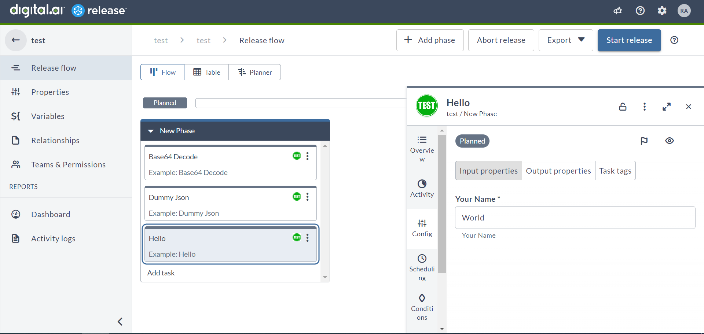
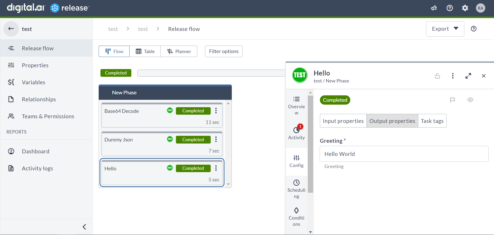
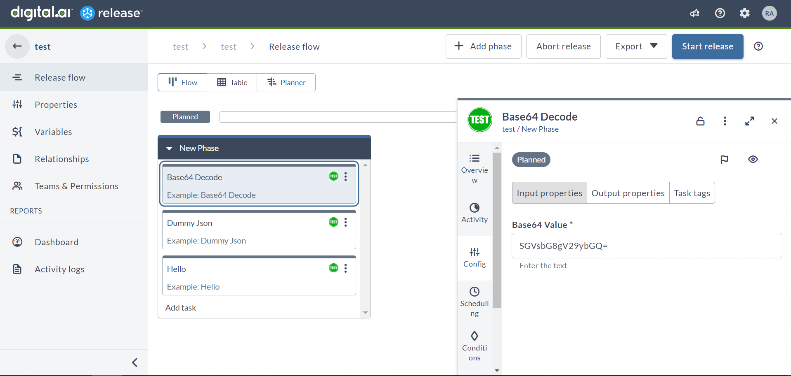
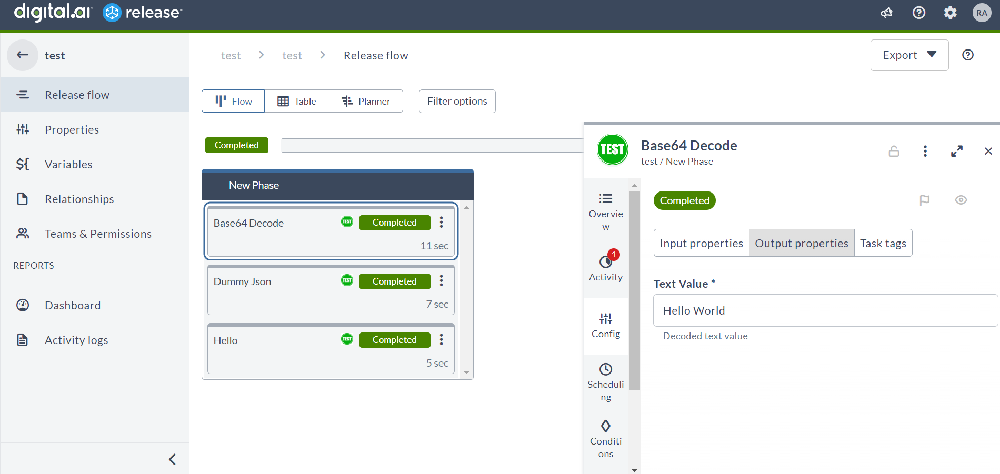
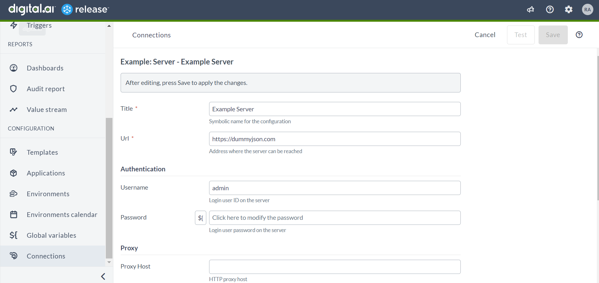
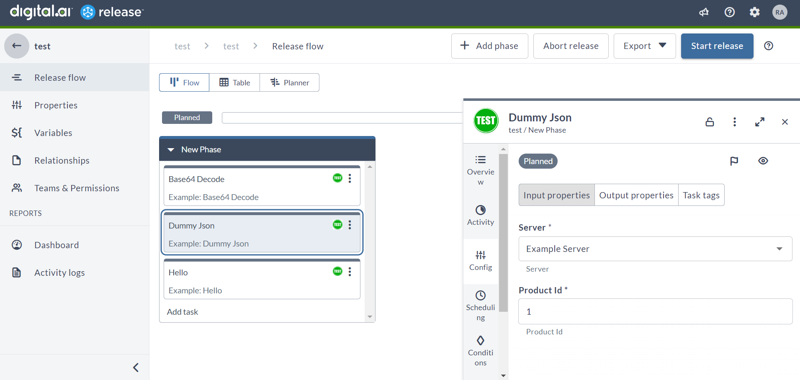
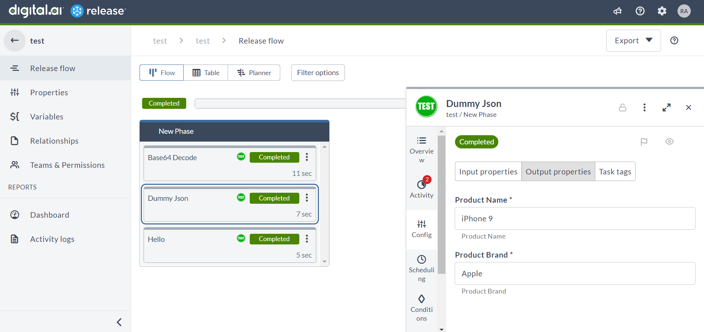

# SDK tutorial outline

## Welcome 

_The tutorial has a welcome section outlining the basic architecture_

_Topics covered:_
* _Tasks are run as containers. This allows you to write Release tasks using any language. We have support for Python3 and Go (soon) in the SDK_
* _SDK provides the tools to create container-based tasks_
* _Architecture: Release instance + Remote Runner_
* _Tasks are developed as container + traditional plugin jar containing metadata_


## Prerequisites

In order to use the Digital.ai Release Integration SDK for Python, you will need:

* Python 3 installed
* Git
* Docker
* A Kubernetes environment, for example Docker Desktop
* Digital.ai Release running
* Digital.ai `xl` command line utility (including `kubectl` and `helm`)


## XXX TODO XXX

* List convenience methods -- link to API?
* Anatomy of a project


## Hello World Plugin

### Preparation

**Install Python 3:** If you haven't already done so, you'll need to install Python 3 on your computer. You can download the latest version of Python from the official website at https://www.python.org/downloads/. 

**Choose an IDE or Text Editor:** You can write Python code using any text editor, but using an IDE (Integrated Development Environment) will help you manage your project better. Some popular IDEs for Python include PyCharm, Visual Studio Code, and Spyder.

### Create a new project in Git

This section describes how you will create a new repository in Git based on the template project.

**Install Git:** If you haven't already done so, you'll need to install Git on your computer. You can download the latest version of Git from the official website at https://git-scm.com/downloads. 

**Open a Terminal or Command Prompt:** Open a terminal or command prompt on your computer.
Navigate to the directory that will containe the project on your computer using the command prompt or terminal. For example, your projects folder.

Follow the instructions to [create a new sdk project in git](../README.md#how-to-create-your-own-project)

Make sure you are in the directory of the new project, for example `mycompany-release-myapp-integration`.

### Create a Python virtual environment

We will create a **virtual environment** in Python, in order to keep all the dependencies of the plugin isolated. This will prevent interference with other Python projects on your computer.

**Create a new Python virtual environment** in the project directory by running the following command in your terminal:

    python -m venv venv

This will create a new directory called `venv` in your project directory that will contain all the Python dependencies.

**Activate the virtual environment** by running the following command

**Windows:**

    venv\Scripts\activate

**Linux / macOS:**

    source venv/bin/activate

Once activated, you should see the name of the virtual environment displayed in your command prompt or terminal, for example `(venv) C:\Users\username\project` on Windows.

Now we can **install the required libraries** using the following command:

    pip install -r requirements.txt 

This command will install the required Python packages listed in the `requirements.txt` file within the virtual environment.

Now you have a virtual environment set up with the required dependencies installed for the project.


### Using PyCharm as an IDE

**Install PyCharm:** If you haven't already done so, you'll need to download and install PyCharm on your computer. You can download the latest version of PyCharm from the official website at https://www.jetbrains.com/pycharm/download/. Make sure to select the appropriate installer for your operating system.

Open PyCharm and select **Open** from the welcome screen. Navigate to the directory where you cloned the project and open it.

**Configure the project interpreter:** PyCharm needs to know which version of Python to use for your project. To configure the project interpreter, go to **File > Settings > Project: your-project > Python Interpreter**. Click on the gear icon and select **Add**. From the dropdown menu, select "New Environment" and choose the appropriate version of Python. Click "OK" to create the new interpreter.

### Python SDK Overview

The Digital.ai Release Python SDK **(digitalai-release-sdk)** is a set of tools that developers can use to create container-based tasks.

Developers can use the `BaseTask` abstract class as a starting point to define their custom tasks and take advantage of the other methods and attributes provided by the SDK to interact with the task execution environment.

To create a custom task, developers need to create a new class that extends the `BaseTask` abstract class and implement the task logic in the subclass.

The SDK will execute the task by calling the `execute()` method in the subclass. The execute method contains the task logic, and it can be customized to perform any necessary operations. In the below example, The `Base64Decode` class is an example of a subclass extends BaseTask. It handles the properties for the input and output values for the task and implements the execute method to decode a Base64 string and output the result.

The `execute_task()` method in the BaseTask abstract class is responsible for executing the task. It calls the `execute()` method and handles any exceptions that may occur during task execution. The `set_exit_code()` and `set_error_message()` methods are used to set the exit code and error message for the task, respectively.

The SDK also provides several other methods and attributes that can be used to interact with the task execution environment. For example, the `add_comment()` method can be used to add a comment to the task output, and the `set_status_line()` method can be used to set the status line for the task. The `get_output_properties()` method returns a dictionary containing the output properties for the task.

The `abort()` method is used to signal to the SDK that the task execution should be aborted. When abort() is called, it sets the exit code to 1 and immediately exits the task process, causing the task to be marked as failed.


### Methods in BaseTask

**BaseTask** abstract class contains the following methods and attributes:

#### Task life cycle

* `__init__(self):` Initializes an instance of the BaseTask class. It creates an OutputContext object with an initial exit code of 0 and an empty dictionary of output properties.
* `execute(self) -> None`: This abstract method must be implemented by subclasses of BaseTask. It represents the main logic of the task. It will be called by the Release execution mechanism. If an `Exception` is raised during execution, the task's exit code is set to 1, and the program exits. The task will fail in that case.
* `abort(self) -> None`: Sets the task's exit code to 1 and exits the program with a status code of 1.
* `set_exit_code(self, value) -> None`: Sets the exit code of the task's OutputContext object.
* `set_error_message(self, value) -> None`: Sets the error message of the task's OutputContext object.

#### Methods to interact with Release

* `get_output_context(self) -> OutputContext`: Returns the OutputContext object associated with the task.
* `get_output_properties(self) -> Dict[str, Any]`: Returns the output properties of this task.
* `add_comment(self, comment: str) -> None`: Adds a comment to the task that will be visible in the UI.
* `set_status_line(self, status_line: str) -> None`: Set the status line of the task. This is update live in the UI.
* `add_reporting_record(self, reporting_record: Any) -> None`: Adds a reporting record to the OutputContext. The reporting records are used in the Audit Report.
* `set_output_property(self, name: str, value: Any) -> None`: Sets the name and value of an output property of the task.
* `get_release_server_url(self) -> str`: Returns the Release server URL of the associated task.
* `get_task_user(self) -> AutomatedTaskAsUserContext:`: Returns the user details that are executing the task.
* `get_default_api_client(self) -> ApiClient:`: Returns an ApiClient object with default configuration based on the task.

### Anatomy of a project

We will walk you the files in this project and tell about their function.

* The `dev-environment`directory contains all the files needed to run a development setup with Digital.ai Release. It allows you to simple `docker compose up` the environment needed to run a plugin.
* The `doc` directory contains guides on how to use the template project. In your own project, this content is not needed.  
_XXX Move this content to the documentation site -- it does not need to live in the template project, we can just have links_
* The `resources` directory contain the assets and metadata of your plugin that are needed by the Release server. The files in the `resources` directory are bundled in the integration jar file.
Notable files here:
  * `test.png`: The icon for the custom tasks in the Release UI
  * `plugin-version.properties`: Contains the plugin name and version. The placeholder values will be replaced by the build script.
  * `synthetic.xml`: This file contains the task released inputs and output details. It defines the input and output fields for the task, as well as any additional properties or configurations that may be necessary. It is discussed in detail below

* The `src` directory contains the Python files of the task execution logic. They will be bundled in the container. The example project contains the following files:
  * `hello.py`: This file contains the logic for the **Hello** task.
  * `base64_decode.py`: This file contains the logic for the **Base64 Decode** task.
  * `dummy_json.py`: This file contains the logic for the **Dummy Json** task.
  * `set_system_message.py`: This file contains the logic for the **Simple API** task.

  Remove these files when creating a new project and replace them with your own logic.
  
* The `tests` directory contains the unit tests for this project. Run the tests with the following command XXX FIND OUT XXX. The following example files come with the template project and can be removed:
  * `test_hello.py`: This file contains the test case for the **Hello** task.
  * `test_base64_decode.py`: This file contains the test case for the **Base64 Decode** task.
  * `test_dummy_json.py`: This file contains the test case for the **Dummy Json** task.

* `build.bat` and `build.sh`: These files build the plugin jar and publish the image to a registry. 
* `Dockerfile`: This is the Dockerfile to create an image for the integration plugin. It includes the necessary steps to build and package the plugin logic in a containerized format.
* `project.properties`: This is the configuration file for the Python project. Use it to configure the plugin name, version, and registry details. It includes properties such as PLUGIN, VERSION, REGISTRY_URL, and REGISTRY_ORG that are used by the build scripts.
* `README.md`: The readme for the project includes information about the project, its purpose, and how to use it. When creating a new project, make sure you change it to give a comprehensive overview of what your integration project is about.
* `requirements.txt`: The list of Python packages and their respective versions that are required to run the project. These packages can be installed using the pip package manager in the virtual environment.

### _Explains coding for xlr-container-helloworld-integration_

#### _Explains synthetic.xml :_

```xml
<synthetic xmlns:xsi="http://www.w3.org/2001/XMLSchema-instance"
           xmlns="http://www.xebialabs.com/deployit/synthetic"
           xsi:schemaLocation="http://www.xebialabs.com/deployit/synthetic synthetic.xsd">

    <type type="example.BaseTask" extends="xlrelease.ContainerTask" virtual="true">
        <!-- Container image - location of the task logic -->
        <property name="image" required="true" hidden="true" default="@registry.url@/@registry.org@/@project.name@:@project.version@" transient="true"/>

        <!-- Task UI properties -->
        <property name="iconLocation" default="test.png" hidden="true"/>
        <property name="taskColor" hidden="true" default="#667385"/>
    </type>

    <type type="example.Hello" extends="example.BaseTask" description="Simple greeter task" label="Container examples: Hello World">
        <property name="yourName" category="input" kind="string" default="World"/>
        <property name="greeting" kind="string" category="output"/>
    </type>

    <type type="example.Base64Decode" extends="example.BaseTask" description="Decode Base64 to text" label="Container examples: Base64 decode">
        <property name="base64Value" category="input"  default="SGVsbG8gV29ybGQ=" description="Enter the text"/>
        <property name="textValue" category="output" description="Decoded text value"/>
    </type>

    <type type="example.DummyJson" extends="example.BaseTask" description="Simple API task" label="Container examples: Connect to server">
        <property name="server" category="input" referenced-type="example.Server" kind="ci"/>
        <property name="productId" category="input" kind="string" default="1"/>
        <property name="productName" kind="string" category="output"/>
        <property name="productBrand" kind="string" category="output"/>
    </type>

    <type type="example.Server" extends="configuration.HttpConnection" description="Configure the server.">
        <!-- Hide the fields which are not relevant for the integration -->
        <property name="domain" default="empty" hidden="true"/>
        <property name="clientId" default="empty" hidden="true"/>
        <property name="clientSecret" default="empty" hidden="true" password="true"/>
        <property name="scope" default="empty" hidden="true"/>
        <property name="accessTokenUrl" default="empty" hidden="true"/>
        <property name="authenticationMethod" kind="enum"
                  enum-class="com.xebialabs.xlrelease.domain.configuration.HttpConnection$AuthenticationMethod"
                  default="Basic" hidden="true">
            <enum-values>
                <value>Basic</value>
            </enum-values>
        </property>
    </type>
  
    <type type="example.SetSystemMessage" extends="example.BaseTask" description="Simple API task" label="Container examples: Set system message">
        <property name="message" category="input" kind="string" description="This message will appear as a banner in the Release UI. Admin access required."/>
    </type>
    
</synthetic>
 ```

The `synthetic.xml` file contains the metadate of the integration plugin. It is part of the plugin jar file that is installed into the Release server. Release uses it to discover the task and connection types that are defined by the integration, along with their descriptions and icons so it can render them in the UI. 

For each type, the synthetic.xml file describes the properties. For example, the input and output properties on a task. For more information on synthetic.xml and the type system used in Release and Deploy, see _XXX WHERE????_

Let's walk through the synthetic.xml document.

  * The `<type>` tag describes either a task or a connection. For a task, it defines the type name using the `type` attribute, a parent type to extend with `extends`, a `description` and `label` that is used to display the task in the UI. 

  * The `example.BaseTask` type defines the common properties for all tasks in this project: container image (filled in by the build script), icon location (relative to the `resources` directory) and the task color. Note that all container tasks must (indirectly) descend from the base type `xlrelease.ContainerTask`.

  * The `example.Hello` type defines the Hello task. We can split the name in two parts:
    * `example` is the category or namespace of the task. Pick a unique name for all the tasks of your integration in order to prevent name clashes with other plugins.
    * `Hello` is the name of the task type. The Python SDK will scan the source folder to find a `Hello` class and create an instance of it at runtime.  
    Furthermore, the `Hello` task definition has one input property `yourName`, using `category="input"` and one output property `greeting` with `category="output".

  * The type `example.Base64Decode` defines properties for input and output values for the Base64Decode task.
  * The type `example.DummyJson` type defines properties for input and output values for the DummyJson task.
  * The type `example.Server` defines an endpoint, not a task. It extends `configuration.HttpConnection` and has properties to set up an HTTP connection. In this example, properties that are not relevant have been disable by setting `hidden="true"`. This type isused in the DummyJson class.
  * The type `example.SetSystemMessage` type defines properties for input values for the Simple API task.

#### Example: Base64Decode.py

```python
  import logging
  import requests
  from digitalai.release.integration import BaseTask
  
  logger = logging.getLogger('Digitalai')
  
  class Base64Decode(BaseTask):
  
      def __init__(self, params):
          super().__init__()
          self.params = params
          self.textValue = None
  
      def execute(self) -> None:
          try:
              base64_value = self.params['base64Value']
              response = requests.get(f'https://httpbin.org/base64/{base64_value}')
              response.raise_for_status()
              if 'Incorrect Base64 data' in response.text:
                  raise ValueError(response.text)
              self.textValue = response.text
          except Exception as e:
              logger.error("Unexpected error occurred.", exc_info=True)
              self.set_exit_code(1)
              self.set_error_message(str(e))
          finally:
              self.set_output_property('textValue', self.textValue)
 ```

The **Base64Decode** class is a subclass of `BaseTask` abstract class and is therefore a task that can be executed.   

This task converts a given Base64 encoded value to plain text.

The **Base64Decode** class has the following attributes:
* `params`: A dictionary containing the parameters required for executing the task. Params value will be passed by the SDK at runtime.
* `textValue`: A variable that stores the resulting plain text value obtained after decoding the Base64 encoded value. This value is passed to the output properties at the end of execution.

The **Base64ToTex**t class has the following methods:
* `__init__(self, params)`: Initializes an instance of the Base64ToText class. 
  * `super().__init__()`: It calls the __init__() method of its superclass BaseTask. It must be present.
  * sets the params and textValue attributes to their default values.
* `execute(self)`: This method implements the abstract method `execute()` from the BaseTask class. It represents the main logic of the task. This method does the following:
  * It retrieves the base64Value parameter from the params dictionary.
  * It makes a GET request to https://httpbin.org/base64/{base64_value} endpoint with base64_value as the value of the Base64 encoded string.
  * It checks whether the response returned contains the message "Incorrect Base64 data". If yes, it raises a ValueError with the response text.
  * If the response is successful, it sets the textValue attribute with the plain text obtained by decoding the Base64 encoded string.
  * If any exception occurs during execution, an error message is logged using the **logger** object and the exit code of the task is set to 1 using the **set_exit_code()** method from **BaseTask**. Additionally, the error message is set using the **set_error_message()** method from **BaseTask**.
  * Finally, the **finally** block is executed, where the textValue attribute is added to the output properties dictionary using the **set_output_property()** method from **BaseTask**.

### _Explains how to run local tests_

#### _Explains test_base64_decode.py :_
  ```python
  import unittest
  
  from src.base64_decode import Base64Decode
  
  class TestBase64Decode(unittest.TestCase):
  
      def test_base64_decode(self):
          params = {
              'task_id': 'task_1',
              'base64Value': 'SGVsbG8gV29ybGQ='
          }
          expected_output = 'Hello World'
          base64_decode = Base64Decode(params)
          base64_decode.execute()
          output_properties = base64_decode.get_output_properties()
          actual_output = output_properties['textValue']
          self.assertEqual(actual_output, expected_output)
  
  if __name__ == '__main__':
      unittest.main()
  ```
This code provides a simple test suite for the Base64Decode class which converts a Base64 encoded string to plain text.

To run the test suite, open a terminal or command prompt and navigate to the root directory of project. Run the following command:

Unix/macOS:

    python3 -m unittest discover tests

Windows:

    py -m unittest discover tests


This command will execute the test suite and report the results in the terminal. If all tests pass, you should see an output like this:

    Ran 3 tests in 2.658s OK


### _(Optional) Explains how to run integration tests in container test framework_

### Build & Run

#### _Explains how to package a plugin and publish the image_
* Configure the plugin and registry details in the **project.properties**
* Open a command prompt and navigate to the root directory of project.
* Unix/macOS  
  * Builds the jar, image and pushes the image to the configured registry  
  ``` sh build.sh ``` 
  * Builds the jar  
  ``` sh build.sh --jar ``` 
  * Builds the image and pushes the image to the configured registry  
   ```  sh build.sh --image ```
* Windows  
  * Builds the jar, image and pushes the image to the configured registry  
  ``` build.bat ``` 
  * Builds the jar  
  ``` build.bat --jar ``` 
  * Builds the image and pushes the image to the configured registry  
  ``` build.bat --image ```

#### _Explains how to install Remote Runner into an existing Kubernetes environment using xl kube install_
* _Configure Release and create token_
* _Launch Remote Runner_
* _Check if it self-registers in Release_

#### _Explains how to install plugin jar into Release_
* To install a new plugin or a new version of an existing plugin, do the following steps:
  * On the navigation bar in Digital.ai Release, click the **Settings** icon, and then click **Manage plugins**.
  * Click the **Installed** plugins tab.
  * Click **Upload** and then select and upload the plugin file from your local machine.
  * After you upload a plugin, you must restart your Digital.ai Release instance.

#### _Explains how to create a template and run_
* Create a template with the task **Example : Hello** and run it!
* **Hello Task input screenshot:**  
<br/> 
* **Hello Task output screenshot:**  
<br/> 

* **Base64 Decode Task input screenshot:**  
<br/> 
* **Base64 Decode Task output screenshot:**  
<br/> 

* **Dummy Json server screenshot:**  
<br/> 
* **Dummy Json Task input screenshot:**  
<br/> 
* **Hello Task output screenshot:**  
<br/> 


#### _Explains how to troubleshoot if task isn’t picked up_
* To do
## Integration plugin


#### How to use live logging
* To do

### Other features
* _How to access the Release API with bundled endpoints_

